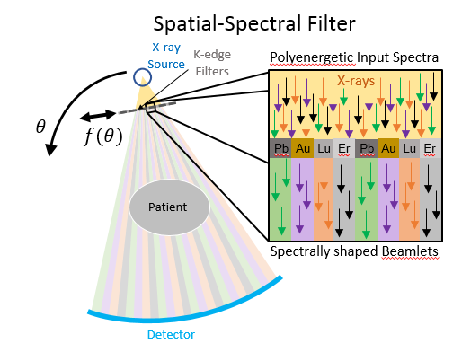

::: spacing
1

# Introduction

Spectral CT is an emerging modality which incorporates varied x-ray
spectral responses into measurements to enable material decomposition
based on material-specific energy dependencies. Existing dual-energy CT
technologies including dual-source and kv-switching systems have already
opened the door to new clinical applications including water-calcium
decomposition for quantitative bone imaging and simultaneous
structural-functional scans with iodine-based contrast
agents.[@mccollough2015dual] Spectral CT systems with more than two
spectral channels enable multi-contrast studies and have the potential
to push the limits of low concentration sensitivity. Photon-counting CT
detectors are an emerging technology that can have multiple spectral
channels [@symons2017photon], but they are subject to a number of
limitations including lower count rates and spectral distortions. Other
multi-energy options include a combination of dual-energy methods (e.g.
split-filters and dual-source) [@primak2009improved].

We have previously proposed a multi-energy CT system involving a
source-side spatial-spectral filter [@stayman2018model]
[@tivnan2019physical] -- a generalization and extension of the
split-filter design. The filter is composed of a tiled array of metals
that divide the incident beam into spectrally varied beamlets. The
filter is translated relative to the source to permit more uniform
spatial-spectral sampling patterns throughout the imaging volume. (See
Figure [1](#fig:system){reference-type="ref" reference="fig:system"} for
an illustration of a spatial-spectral CT system.) Each spectral channel
is sparse in the projection domain, so a model-based iterative
reconstruction (MBIR) is adopted for direct estimation of material
density/concentration image volumes. Such sparse projection data are
well-suited to compressed sensing or other advanced regularization
schemes [@bian2010evaluation] [@koesters2017sparsect]. Spatial-spectral
filters permit flexibility in the number of spectra that can be
incorporated, and can potentially be combined with other spectral
methods for improved decomposition performance.

In this work, we seek optimized designs for physical implementation by
characterizing the impact of filter parameters, including filter tile
width and filter tile order, on material decomposition performance.
Simulation studies are presented and practical design constraints are
identified for the new spectral CT system. By modeling a realistic CT
geometry and noise properties including low concentrations of three
different contrast agents in water, we intend to demonstrate the
capability of this new design to explore the limits of material
decomposition with spatial-spectral CT.

<figure id="fig:spectralSampling">
<figure id="fig:system">

<figcaption aria-hidden="true"></figcaption>
</figure>
<figure id="fig:spatialSpectralSampling">

  

<figcaption></figcaption>
</figure>
<figcaption> (a) Schematic of a spatial-spectral CT system and (b)
sampling patterns for 3 beamlet width cases. The Pb, Au, Lu, and Er
spectra, are green, violet, orange, and black,
respectively.</figcaption>
</figure>

# Methods

## Numerical Phantom and Simulated Acquisition

The numerical CT phantom used for simulation experiments is shown in
Figure [4](#fig:x_GT){reference-type="ref" reference="fig:x_GT"}. The
object consists of four materials: a centered 50 mm-diameter cylindrical
tank of water (identified by the outer circle) and cylindrical inserts
containing I-based, Gd-based, and Au-based contrast agents. The contrast
inserts had concentrations between 0.2-1.6 mg/mL and were arranged in
two rings. The outer ring contained single-contrast-agent solutions in
water and the inner ring contained various two-contrast-agent mixtures.
Figure [4](#fig:x_GT){reference-type="ref" reference="fig:x_GT"} shows
the arrangement of contrast inserts as well as a Red-Yellow-Blue
subtractive color-mixed image.

We simulated a diverging beam CT system with a source-detector-distance
of 1105 mm, a source-axis-distance of 829 mm, 360 view angles, and
0.556 mm detector pixels. The spatial-spectral filter was positioned
380 mm from the source and was composed of Pb, Au, Lu, and Er tiles with
thicknesses 0.25 mm, 0.10 mm, 0.13 mm, and 0.25 mm, respectively. Gantry
rotation speed was 60 RPM and filter translation speed was 100 mm/s
which corresponds to 0.5 pixels per view. We also modeled spectral blur
due to filter motion and a 1.0 mm extended focal spot.

Poisson noise was added to the data scaled to $10^5$ (incident) photons
per pixel per view for the lead-filtered spectrum. Reconstructions were
performed using the model-based material decomposition algorithm
described in Tilley et al. [@tilley2018model] with 0.5 mm voxels and
using 800 iterations, ordered-subsets, and momentum-based acceleration.
Material decomposition performance was characterized by the
Root-Mean-Squared Error (RMSE) with respect to the ground truth for
4.0 mm cylindrical regions of interest (ROI) centered on each of the
6.0 mm cylindrical inserts.

## Filter Tile Order

To determine the effect of filter tile order, filter tile width was held
constant at 1.52 mm (corresponding to an 8 pixel beamlet at the
detector) and the order of the four filter materials was set to each
possible permutation. Only the relative order of filter tiles was
changed in this experiment, not the pattern phase shift (i.e. start
position for filter translation). Therefore there were six possible
filter tile orders for a set of four filter materials. Eight trials were
also conducted for each filter order to characterize performance in the
presence of noise. This experiment was designed to answer whether the
joint effect of the spectral response of the filter materials and their
relative position in the linear filter array would lead to variations in
material decomposition performance.

## Filter Tile Width

To determine the effect of filter tile width, filter order was held
constant in descending order of K-edge energy (Pb-Au-Lu-Er) and the
filter tile widths were adjusted between 0.2-15.3 mm corresponding to
1-80 pixel beamlets at the detector. Filter tile width changes the
spatial-spectral sampling pattern as shown in Figure
[2](#fig:spatialSpectralSampling){reference-type="ref"
reference="fig:spatialSpectralSampling"}.

If the filter tile width is too small, there is the potential for
significant variation of the spectrum over the width of the beamlet due
to blurring effects (e.g. extended focal spot). In contrast, if the
filter tile width is too wide, some regions of the image may be
undersampled in some spectral channels. The motivation for this
numerical experiment was to inform engineering design decisions by
characterizing those regions of operation.

# Results

## Filter Tile Order

::: wrapfigure
r0.64 
:::

Results for filter tile order experiment are shown in Figure
[\[fig:filterOrderPlot\]](#fig:filterOrderPlot){reference-type="ref"
reference="fig:filterOrderPlot"}. They show little, if any benefit to
any of the six permutations. RMSE is centered between 0.24 mg/mL and
0.26 mg/mL for each case, a difference of less than 8%, and the standard
deviations of RMSE computed across the eight trials was between
0.008 mg/mL and 0.012 mg/mL, or around $\pm$`<!-- -->`{=html}5%, for all
cases. This result does not point to a specific filter tile order that
is particularly beneficial or detrimental to performance.

## Filter Tile Width

::: wrapfigure
r0.52 
:::

Image results for the filter tile width simulations are shown in Figure
[\[fig:RYB\]](#fig:RYB){reference-type="ref" reference="fig:RYB"}. The
images for the 3-pixel beamlet case in
[5](#fig:xi_3){reference-type="ref" reference="fig:xi_3"} shows poor
material decomposition performance, as does the 50-pixel case in
[7](#fig:xi_50){reference-type="ref" reference="fig:xi_50"}. The closest
match to the ground truth in [4](#fig:x_GT){reference-type="ref"
reference="fig:x_GT"} is the 8-pixel case in
[6](#fig:xi_8){reference-type="ref" reference="fig:xi_8"} which strikes
the balance between the two extremes. Note specifically the iodine and
gold (red and blue) regions which are only well-separated in the 8-pixel
case. The 8-pixel case is fine enough for sufficient sampling without
being subject to significant spectral blur.

The RMSE plot in Figure
[\[fig:filterTileWidthPlot\]](#fig:filterTileWidthPlot){reference-type="ref"
reference="fig:filterTileWidthPlot"} shows the same phenomenon. There is
a sharp decrease in the range of 0-6 pixel beamlets (note that the focal
spot is 5.2 pixels at the detector). There is a gradual increase in RMSE
for wider filter tile widths that have coarser spatial-spectral
sampling.

The trend in Figure
[\[fig:filterTileWidthPlot\]](#fig:filterTileWidthPlot){reference-type="ref"
reference="fig:filterTileWidthPlot"} also features an interesting
modulation. We suspect this may be due to effects that phase in and out
with different spatial-spectral sampling patterns (which is also a
function of the filter translation speed). For example, there are some
sampling patterns in which lines of response are more likely to be
sampled by the same spectrum as their complementary ray. One would
expect improved performance if these redundancies were minimized.

# Conclusion

::: wrapfigure
r0.70

{#fig:x_GT}

{#fig:xi_3}

{#fig:xi_8}

{#fig:xi_50}

:::

Filter tile order does not appear to have a significant impact on
material decomposition performance indicating that it is a low-priority
design consideration. Filter tile width has a more substantial effect.
Based on the results of this work, we propose that filter tile width for
spatial spectral filters should be chosen as fine as possible while
keeping the beamlet width wider than the size of the blur due to the
extended focal spot and filter motion during integration. These
constraints will be balanced with filter fabrication limitations for the
final filter design. Results from these experiments will be used as part
of a rigorous quantitative design and development of a new spectral CT
system using spatial-spectral filters. Ongoing and future work will
include investigations of spatial-spectral sampling patterns including
the impact of different filter translation speeds and, possibly,
non-linear filter motions.

This work was supported, in part, by NIH grants R21EB026849 and
F31EB023783.
:::
